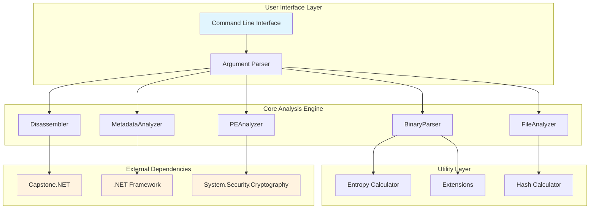
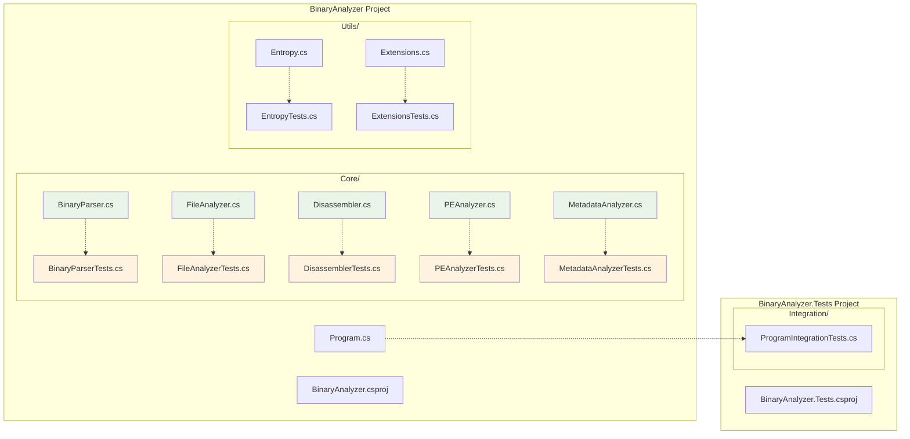
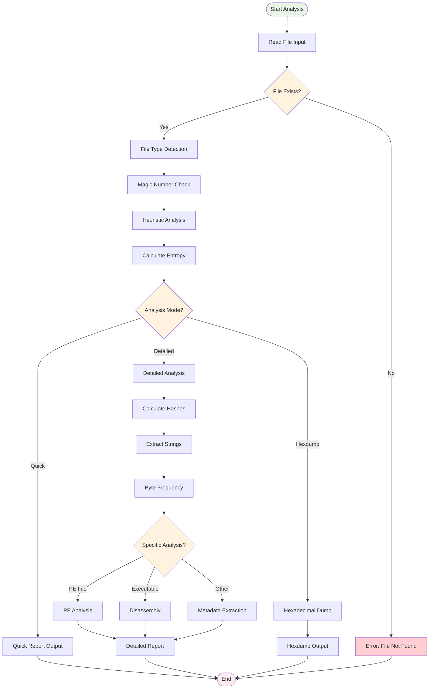
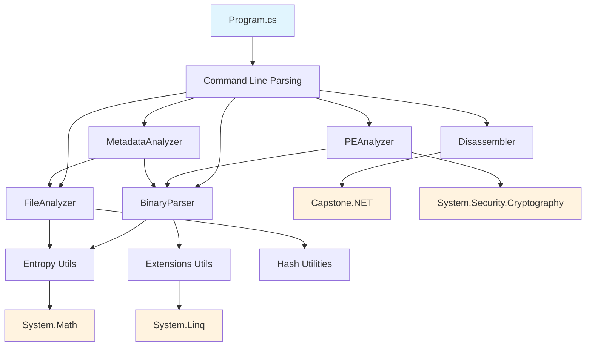
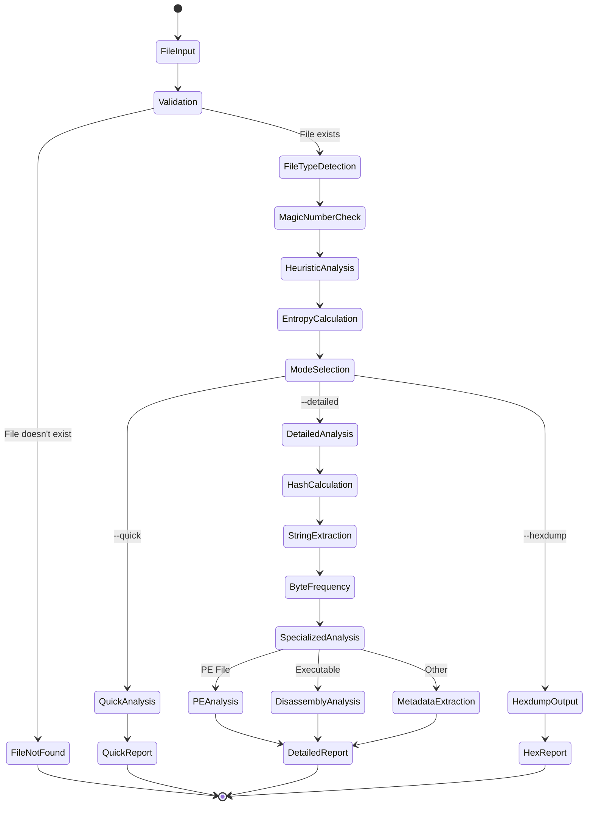
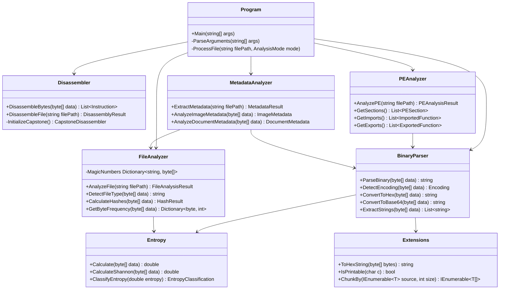
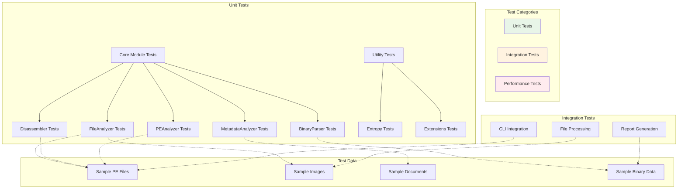
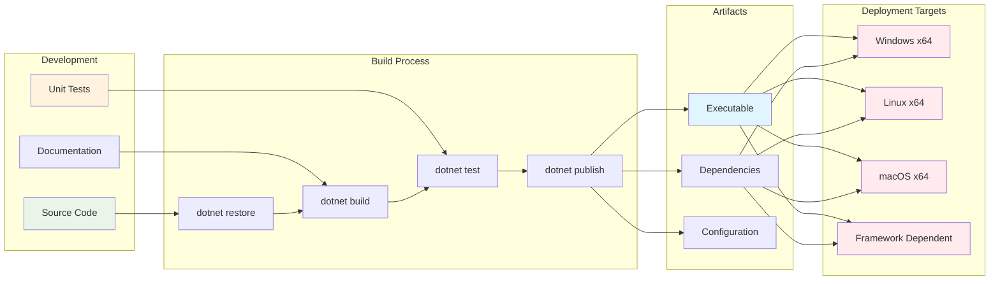
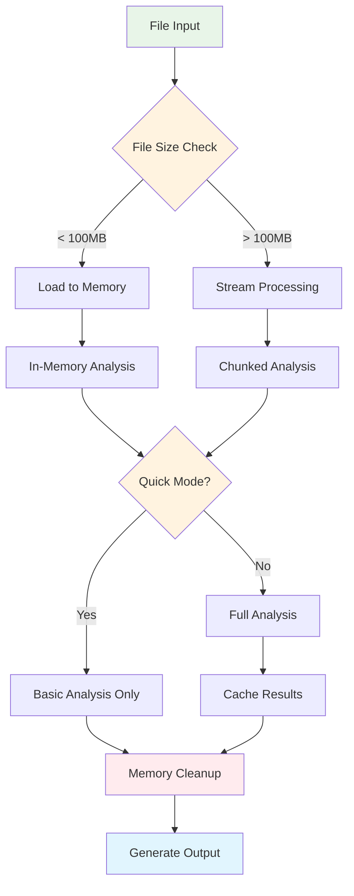
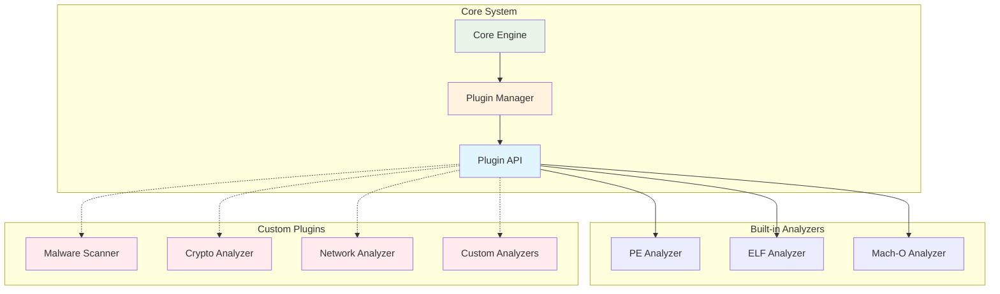

# 🏗️ Binary Analyzer Architecture

This document provides a comprehensive overview of the Binary Analyzer's architecture, component relationships, and data flow using visual diagrams.

## 📋 Table of Contents

- [System Overview](#system-overview)
- [Component Architecture](#component-architecture)
- [Data Flow](#data-flow)
- [Module Dependencies](#module-dependencies)
- [File Processing Pipeline](#file-processing-pipeline)
- [Class Relationships](#class-relationships)
- [Testing Architecture](#testing-architecture)
- [Deployment Architecture](#deployment-architecture)

## 🔍 System Overview

The Binary Analyzer is designed as a modular, extensible system for analyzing binary files with clear separation of concerns.

## 🧩 Component Architecture

### Core Components Structure

## 🔄 Data Flow

### File Analysis Pipeline

## 🔗 Module Dependencies

### Dependency Graph

## 🔧 File Processing Pipeline

### Processing Stages

## 🏛️ Class Relationships

### Core Classes UML

## 🧪 Testing Architecture

### Test Structure

## 🚀 Deployment Architecture

### Build and Deployment Pipeline

## 📊 Performance Considerations

### Memory and Processing Flow

## 🔧 Extension Points

### Plugin Architecture (Future)

## 📚 Architecture Principles

### Design Patterns Used

1. **Single Responsibility Principle**: Each analyzer handles one specific type of analysis
2. **Dependency Injection**: Core components are loosely coupled
3. **Factory Pattern**: File type detection and analyzer selection
4. **Strategy Pattern**: Different analysis modes (quick, detailed, hexdump)
5. **Observer Pattern**: Progress reporting and logging (future enhancement)

### Key Architectural Decisions

- **Modular Design**: Each analyzer is independent and can be extended
- **Immutable Data**: Analysis results are read-only objects
- **Stream Processing**: Large files are processed in chunks
- **Error Isolation**: Failures in one analyzer don't affect others
- **Extensible Framework**: Easy to add new file format support

---

*This architecture documentation is maintained alongside the codebase and should be updated when significant structural changes are made.*
